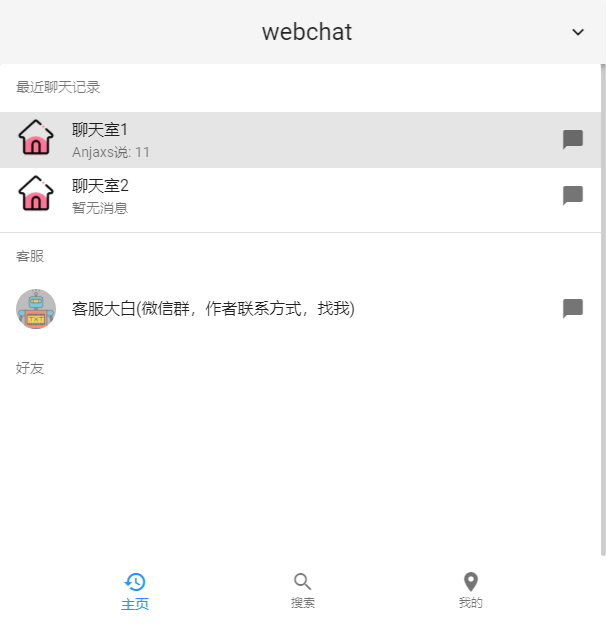
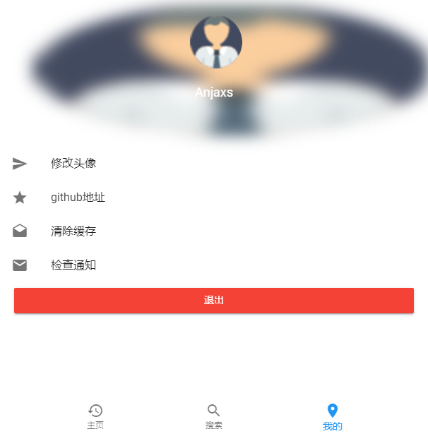
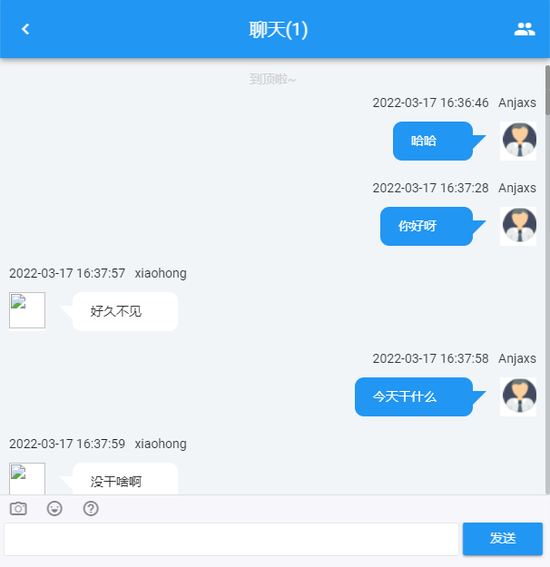
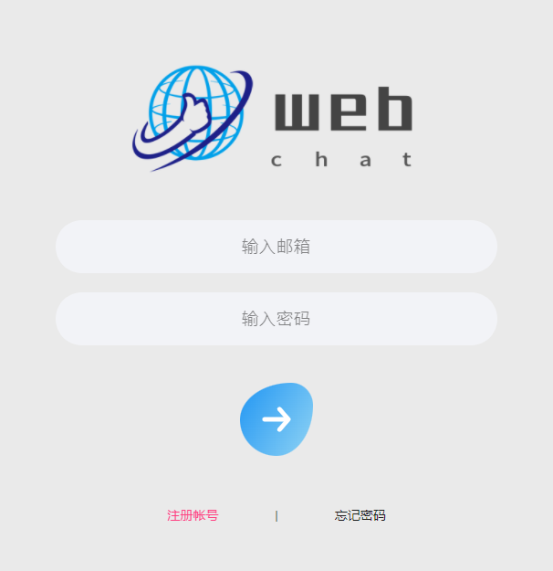

# webchat

这个项目是一个在线聊天项目，前端代码来源 https://github.com/hua1995116/webchat ，后端采用 PHP 的 hyperf 框架。<a href="https://console-docs.apipost.cn/cover.html?url=e627c6ac66ea474a&salt=5a2e27226f174896">api 文档链接</a>


## 功能

- [x] 注册登录功能
- [x] 聊天功能
- [x] 查看历史记录
- [x] 多个聊天室
- [x] 与阿里机器人对接
- [x] 图片发送
- [x] 发送链接
- [x] 发送表情
- [x] 图片预览
- [x] 消息未读
- [x] 断线重连
- [] 好友资料查看
- [] 添加好友
- [] 单聊
- [] 搜索好友
- [] 热门好友推荐


## 服务器要求

 - PHP >= 7.4
- Swoole PHP 扩展 >= 4.5，并关闭了 `Short Name`
 - JSON PHP 扩展
 - Pcntl PHP 扩展
 - OpenSSL PHP 扩展
 - PDO PHP 扩展
 - Redis PHP 扩展

启动客户端
```
$webchat cd client

$client npm install -----安装依赖

$client npm run serve -----运行
```
启动服务端
```
$webchat composer install

$webchat php bin/hyperf.php migrate

$webchat php bin/hyperf.php start
```

## 打包

打包客户端
```
cd client

npm run build
```

服务端运行
```
cd ..

npm run prod
```

## 技术栈

 - 前端 vue vue-router vuex
 - 后端 hyperf
 - 数据库 mysql redis
 - 通讯 websocket

## 效果









## License

[MIT](http://opensource.org/licenses/MIT)

MIT License

Copyright (c) 2022 Anjaxs